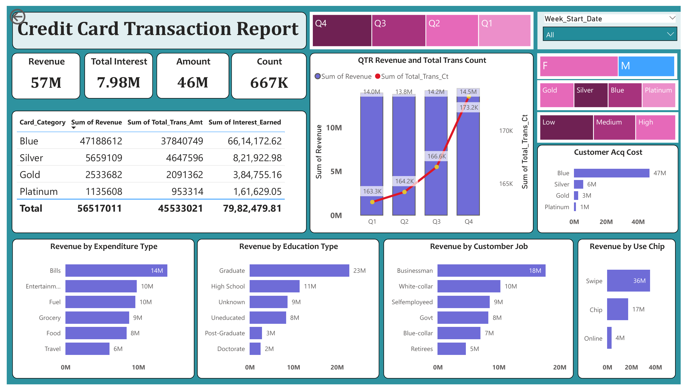
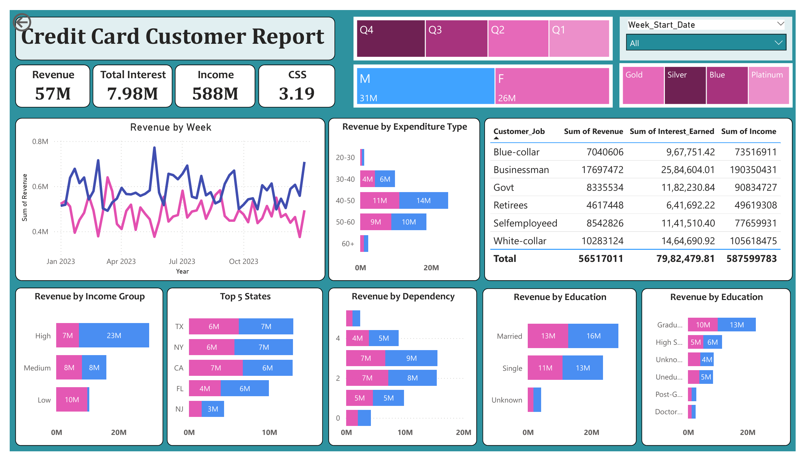

# Credit Card Financial Dashboard

An interactive **Power BI dashboard** developed to analyze credit card transactions, customer behavior, revenue, interest, and spending patterns.

This project combines **SQL, Python, Power Query, DAX, and Power BI** to transform raw customer and transaction data into meaningful business insights.

---

## 📊 Dashboard Preview

### Credit Card Transaction Report

<p align="center">
  
</p>

This dashboard focuses on:

- Revenue and transaction performance
- Card category analysis
- Expenditure patterns
- Quarterly performance
- Transaction types
- Customer occupation and education
- Income and gender analysis

### Credit Card Customer Report

<p align="center">
  
</p>

This dashboard focuses on:

- Weekly revenue trends
- Customer segmentation
- Income groups
- Customer occupation
- Education and demographics
- State-wise revenue
- Card category
- Customer satisfaction

---

## 📌 Key Performance Indicators

| Metric | Value |
|---|---:|
| Total Revenue | 57M |
| Total Interest | 7.98M |
| Transaction Amount | 46M |
| Total Transactions | 667K |
| Customer Income | 588M |
| Satisfaction Score | 3.19 |

---

## 🔍 Key Insights

- **Blue cards** generate the highest revenue among card categories.
- **Q4** records the highest quarterly revenue and transaction activity.
- **Bills** contribute the highest revenue among expenditure categories.
- **Swipe transactions** account for the largest share of transaction revenue.
- **Businessman customers** are one of the major revenue-generating occupation groups.
- **High-income customers** contribute the largest share of revenue.
- Revenue varies across different customer demographics and states.

---

## 🔄 Project Workflow

```text
Raw Data
   ↓
Data Cleaning & Preparation
   ↓
SQL Analysis
   ↓
Python / Pandas
   ↓
Power Query
   ↓
Data Modeling
   ↓
DAX Measures
   ↓
Power BI Dashboard
   ↓
Business Insights
```

## Tools & Technologies

| Area | Tools / Technologies |
|------|----------------------|
| **BI & Dashboarding** | Power BI |
| **Data Transformation** | Power Query |
| **Programming** | Python |
| **Data Analysis** | Pandas |
| **Database** | SQL |
| **Data Modeling** | Power BI Data Model |
| **Calculations** | DAX |
| **Visualization** | Charts, KPI Cards, Tables, Slicers & Filters |


## Repository Structure

```text
Credit_Card_Financial_Dashboard/
│
├── Credit_card_report.pbix       # Power BI dashboard
├── SQL_QUERY.sql                 # SQL queries
├── file.py                       # Python data processing/analysis
│
├── credit_card.csv               # Credit card transaction data
├── credit_card_fixed.csv         # Cleaned transaction data
├── customer.csv                  # Customer data
│
├── transaction-dashboard.png     # Transaction dashboard preview
├── customer-dashboard.png        # Customer dashboard preview
│
└── README.md                     # Project documentation
